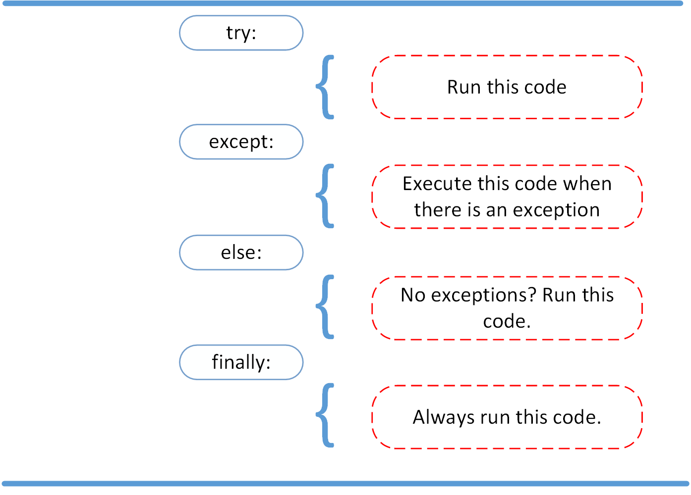

# Reading Questions

## What is the purpose of the ‘with’ statement when opening a file in Python, and how does it help manage resources while reading and writing files?

- The with statement automatically takes care of closing the file once it leaves the with block, even in cases of error. it highly recommend to use with statement as much as possible, as it allows for cleaner code and makes handling any unexpected errors easier.

## Explain the difference between the ‘read()’ and ‘readline()’ methods for file objects in Python. Provide examples of when to use each method.

- .read(): This reads from the file based on the number of size bytes. If no argument is passed or None or -1 is passed, then the entire file is read.

 example of how to open and read the entire file using .read():

>>> with open('dog_breeds.txt', 'r') as reader:
>>>     # Read & print the entire file
>>>     print(reader.read())

          Pug
        Jack Russell Terrier
        English Springer Spaniel
        German Shepherd
       Staffordshire Bull Terrier
       Cavalier King Charles Spaniel
       Golden Retriever
       West Highland White Terrier
       Boxer
       Border Terrier

- .readlines():This reads the remaining lines from the file object and returns them as a list.

 example of how to read 5 bytes of a line each time using the Python .readline() method:

>>> with open('dog_breeds.txt', 'r') as reader:
>>>     # Read & print the first 5 characters of the line 5 times
>>>     print(reader.readline(5))
>>>     # Notice that line is greater than the 5 chars and continues
>>>     # down the line, reading 5 chars each time until the end of the
>>>     # line and then "wraps" around
>>>     print(reader.readline(5))
>>>     print(reader.readline(5))
>>>     print(reader.readline(5))
>>>     print(reader.readline(5))

              Pug

              Jack
              Russe
              ll Te
              rrier

## Briefly describe the concept of exception handling in Python. How can the ‘try’, ‘except’, and ‘finally’ blocks be used to handle exceptions and ensure proper execution of code? Provide a simple example
 
 The try and except block in Python is used to catch and handle exceptions. Python executes code following the try statement as a “normal” part of the program. The code that follows the except statement is the program’s response to any exceptions in the preceding try clause.
after that, implement some sort of action to clean up after executing your code. Python enables you to do so using the finally claus

ex:
-     try:
-      linux_interaction()
-     except AssertionError as error:
-      print(error)
-     else:
-      try:
-        with open('file.log') as file:
-            read_data = file.read()
-      except FileNotFoundError as fnf_error:
-        print(fnf_error)
-     finally:
-      print('Cleaning up, irrespective of any exceptions.')

### Things I want to know more about